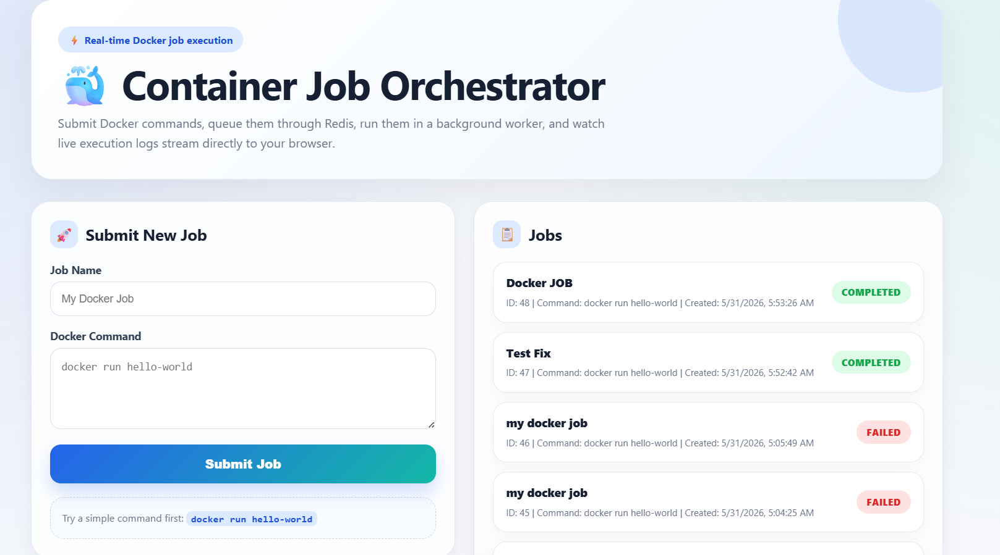

# Container Job Orchestrator

A real-time container job execution platform built with FastAPI, Redis, PostgreSQL, Docker, and WebSockets.

This project allows users to submit Docker-based jobs from a web UI. The backend stores the job, places it in a Redis queue, and a separate worker process picks it up and runs it. While the job is running, logs are streamed live back to the browser using WebSockets.

## UI

```md

```

## What This App Does

This application demonstrates how a real backend job execution system works.

In simple terms:

1. A user submits a job from the frontend.
2. The FastAPI backend saves the job in PostgreSQL.
3. The backend pushes the job ID into a Redis queue.
4. A background worker takes the job from the queue.
5. The worker runs the Docker command.
6. The worker publishes live logs through Redis Pub/Sub.
7. FastAPI sends those logs to the browser using WebSockets.
8. The frontend displays the job logs in real time.
9. The job status is updated as pending, running, completed, or failed.

This project is useful for learning:

* Backend job queues
* Worker-based architecture
* Docker-based execution
* Redis queues
* Redis Pub/Sub
* WebSocket log streaming
* PostgreSQL database storage
* Docker Compose multi-service setup

## Why This Project Exists

Normally, web apps should not run long tasks directly inside an API request.

For example, if a user submits a Docker job, the API should not wait until the Docker job finishes. That would make the API slow and unreliable.

Instead, this project uses a better architecture:

* FastAPI receives the job quickly.
* Redis stores the job in a queue.
* A worker runs the job in the background.
* WebSockets show the live output to the user.

This is similar to how real systems handle background jobs, CI pipelines, code runners, and task execution platforms.

## Tech Stack

### Backend

* FastAPI
* SQLAlchemy async
* Pydantic
* Uvicorn

### Database

* PostgreSQL

### Queue and Log Streaming

* Redis List for job queue
* Redis Pub/Sub for live logs

### Worker

* Python async worker
* Docker command execution using subprocess

### Frontend

* HTML
* CSS
* JavaScript
* WebSocket API

### DevOps

* Docker
* Docker Compose

## Architecture

```text
User Frontend
    |
    | Submit job
    v
FastAPI Backend
    |
    | Save job
    v
PostgreSQL Database
    |
    | Push job_id
    v
Redis Queue
    |
    | Worker takes job_id
    v
Worker Process
    |
    | Run Docker command
    v
Docker Engine
    |
    | Logs
    v
Redis Pub/Sub
    |
    | Subscribe to logs
    v
FastAPI WebSocket
    |
    | Send live logs
    v
Frontend Log Viewer
```

## Project Structure

```text
container-job-orchestrator/
│
├── src/
│   ├── config.py
│   ├── database.py
│   ├── main.py
│   ├── models.py
│   ├── queue.py
│   ├── schemas.py
│   └── worker.py
│
├── frontend/
│   └── index.html
│
├── Dockerfile.dev
├── docker-compose.yaml
├── init-db.sql
├── requirements.txt
└── README.md
```

## File Explanation

### `src/config.py`

This file stores all project configuration.

It loads values from environment variables, such as:

* Database URL
* Redis URL
* App host
* App port
* Redis queue name
* Redis log channel prefix

This is useful because Docker Compose can provide different settings without changing the code.

Example:

```python
DATABASE_URL = os.getenv("DATABASE_URL")
REDIS_URL = os.getenv("REDIS_URL")
```

The app and worker both use this file so they connect to the same database and Redis service.

## `src/database.py`

This file handles the database connection.

It uses SQLAlchemy async to connect to PostgreSQL.

Main responsibilities:

* Create the database engine
* Create async database sessions
* Define the base model class
* Create database tables when the app starts

Important parts:

```python
engine = create_async_engine(settings.DATABASE_URL)
```

This creates the connection to PostgreSQL.

```python
AsyncSessionLocal = async_sessionmaker(...)
```

This creates database sessions that are used when reading or writing jobs.

```python
init_db()
```

This creates tables if they do not already exist.

## `src/models.py`

This file defines the database table structure.

The main model is `Job`.

Each job stores:

* `id`: unique job ID
* `name`: job name
* `command`: Docker command submitted by the user
* `status`: pending, running, completed, or failed
* `created_at`: when the job was created
* `completed_at`: when the job finished
* `exit_code`: exit code from the Docker command
* `description`: optional job description

This file controls how job data is stored inside PostgreSQL.

## `src/schemas.py`

This file defines the API request and response formats using Pydantic.

It makes sure the data sent to and returned from the API has the correct shape.

Main schemas:

### `JobCreate`

Used when a user submits a new job.

Example request:

```json
{
  "name": "Hello World Job",
  "command": "docker run hello-world"
}
```

### `JobResponse`

Used when the API returns job details.

Example response:

```json
{
  "id": 1,
  "name": "Hello World Job",
  "command": "docker run hello-world",
  "status": "pending",
  "created_at": "2026-01-01T10:00:00",
  "completed_at": null,
  "exit_code": null
}
```

### `JobListResponse`

Used when returning a list of jobs.

## `src/queue.py`

This file manages Redis.

Redis is used for two things in this project:

1. Job queue
2. Live log streaming

### Job Queue

When a user submits a job, FastAPI pushes the job ID into Redis.

```python
await redis_queue.enqueue_job(job.id)
```

The worker then takes jobs from Redis.

```python
job_id = await redis_queue.dequeue_job()
```

This keeps the API fast because the API does not run the job directly.

### Redis Pub/Sub for Logs

When the worker runs a Docker command, it reads the output line by line.

Each log line is published to Redis:

```python
await redis_queue.publish_log(job_id, line)
```

FastAPI subscribes to the Redis channel and forwards logs to the browser using WebSockets.

This is how the user sees live logs.

## `src/main.py`

This is the main FastAPI application.

It contains:

* App startup logic
* REST API endpoints
* WebSocket endpoint
* Frontend serving
* Health check endpoint

### Important Endpoints

#### `GET /`

Serves the frontend HTML page.

#### `POST /jobs`

Creates a new job.

Flow:

1. Receive job name and command from frontend.
2. Save job in PostgreSQL with status `pending`.
3. Push job ID into Redis queue.
4. Return the job details to the frontend.

#### `GET /jobs`

Returns all submitted jobs.

#### `GET /jobs/{job_id}`

Returns details of one job.

#### `DELETE /jobs/{job_id}`

Deletes a job from the database.

#### `WebSocket /ws/{job_id}`

Streams live logs for a specific job.

The frontend connects to this WebSocket when the user opens the log viewer.

## `src/worker.py`

This is the background worker.

It runs separately from the FastAPI app.

The worker continuously checks Redis for new jobs.

Worker flow:

1. Connect to Redis.
2. Connect to PostgreSQL.
3. Wait for a job ID from Redis queue.
4. Get job details from the database.
5. Mark job as `running`.
6. Run the Docker command.
7. Stream output logs through Redis Pub/Sub.
8. Mark job as `completed` or `failed`.
9. Save the exit code in the database.

This separation is important because the API server should not run heavy background tasks directly.

## `frontend/index.html`

This is the frontend of the project.

It contains:

* Job submission form
* Jobs list
* Live log viewer
* WebSocket connection logic

Frontend features:

* Submit a new Docker job
* View all jobs
* Click a job to see logs
* Automatically open logs after submitting a job
* Refresh job status every few seconds
* Show live logs from the WebSocket

The frontend uses normal HTML, CSS, and JavaScript, so it is easy to understand for beginners.

## `Dockerfile.dev`

This file defines the Docker image used by the app and worker during development.

It:

* Uses Python 3.11
* Sets `/app` as the working directory
* Installs system dependencies
* Installs Python packages from `requirements.txt`
* Copies backend source code
* Copies frontend files
* Runs the FastAPI app using Uvicorn

In development, this project uses `--reload`, so FastAPI restarts automatically when code changes.

## `docker-compose.yaml`

This file runs the full project using Docker Compose.

It starts multiple services together:

### `postgres`

Runs the PostgreSQL database.

Used for storing job records.

### `redis`

Runs Redis.

Used for:

* Job queue
* Live log streaming

### `app`

Runs the FastAPI backend.

It handles:

* API requests
* WebSocket connections
* Serving the frontend

### `worker`

Runs the background worker.

It handles:

* Reading jobs from Redis
* Running Docker commands
* Publishing logs
* Updating job status

Docker Compose is useful because the entire project can be started with one command.

## `init-db.sql`

This file initializes the PostgreSQL database.

It creates the project database and gives permissions to the database user.

## `requirements.txt`

This file lists the Python dependencies required by the backend and worker.

Common dependencies include:

* FastAPI
* Uvicorn
* SQLAlchemy
* asyncpg
* Redis
* python-dotenv
* Pydantic


Recommended folder structure:

```text
screenshots/
└── ui.png
```

After taking a screenshot of the app, place it inside the `screenshots` folder and name it `ui.png`.

## How to Run the Project

### 1. Clone the repository

```bash
git clone https://github.com/your-username/container-job-orchestrator.git
cd container-job-orchestrator
```

### 2. Make sure Docker is running

Before starting the project, open Docker Desktop or make sure the Docker daemon is running.

Check Docker:

```bash
docker --version
```

Check Docker Compose:

```bash
docker compose version
```

### 3. Start the project

Run:

```bash
docker compose up --build
```

This will start:

* FastAPI backend
* Worker process
* Redis
* PostgreSQL

### 4. Open the app

Go to:

```text
http://localhost:8000
```

### 5. Submit a job

Example job:

```text
Job Name: Hello World
Docker Command: docker run hello-world
```

Click submit.

The app should:

1. Create the job.
2. Add it to the queue.
3. Start the worker.
4. Run the Docker command.
5. Show live logs in the browser.
6. Update the job status.

## Example Commands to Try

### Hello World container

```bash
docker run hello-world
```

### Python container

```bash
docker run python:3.11-slim python -c "print('Hello from Python container')"
```

### Alpine Linux command

```bash
docker run alpine echo "Hello from Alpine"
```


## What I Learned From This Project

This project helped me understand:

* How API servers and workers communicate
* Why queues are used in backend systems
* How Redis can be used for background jobs
* How Redis Pub/Sub can stream live messages
* How WebSockets work in real time
* How Docker commands can be executed from a worker
* How job status is stored and updated in a database
* How multiple services can run together using Docker Compose


## Final Summary

This is a beginner-friendly but realistic backend infrastructure project.

It shows how to build a system where users can submit jobs, workers execute them in the background, and logs are streamed live to the frontend.

The project combines FastAPI, Redis, PostgreSQL, Docker, WebSockets, and Docker Compose into one complete system.
